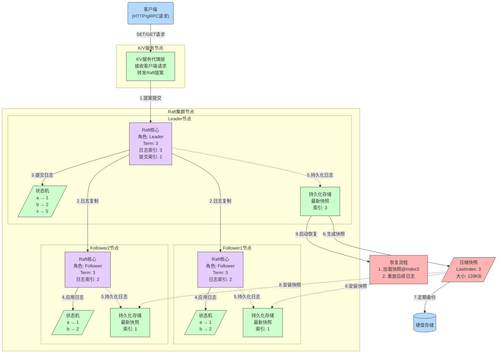
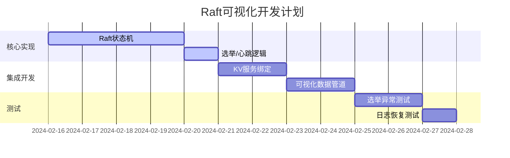
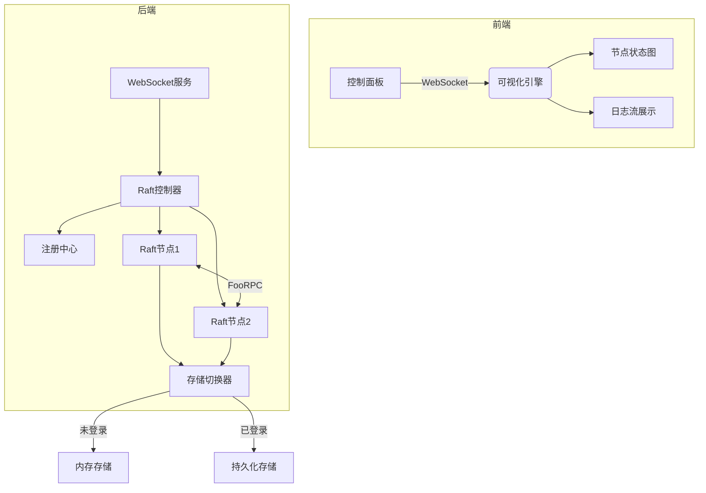
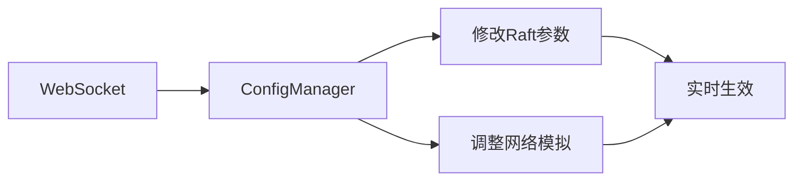
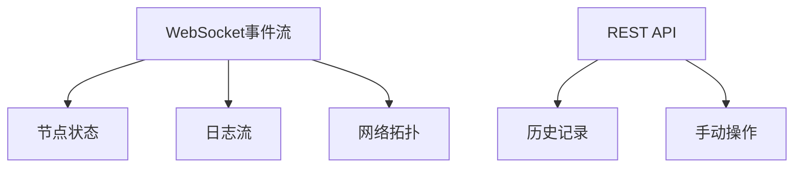
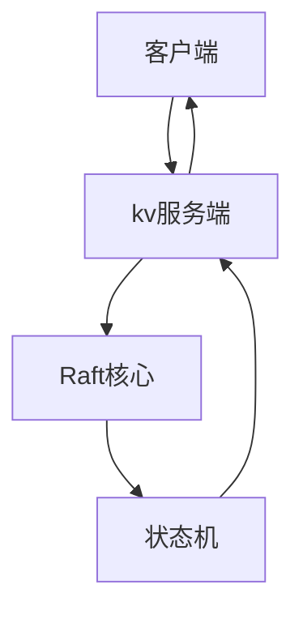

# Raft 开发文档

关于该Raft的核心实现，我是借鉴[hashicorp/raft](https://github.com/hashicorp/raft)的实现。来完成我的Raft核心，个人无法做好Raft的所有功能，但是我想实现Raft的主要功能来展示可视化，比如**领导选举**、**心跳，日志同步**、**安全性**和**持久性**。

## 核心想法

我想通过一个键值存储（Key/Value store）来模拟使用了Raft共识算法的节点（peers）之间的通信，并可视化该服务的集群，以展示Raft的核心功能。

## Key/Value store

### Write

在对于写端有两种情况：

1. 未登录情况下。使用内存来存储写的数据
2. 登录情况下。使用第三方来存储来为写入的数据提供持久化

**Set**，用来向Key/Value store中写入数据

### Read

**Get**，用来从Key/Value store中读取数据

## Raft 核心

[Raft 核心](core.md)

## 开发流程

## 使用Raft核心可视化流程

这个是对Raft核心结构的描述，下面我们来看看Raft的可视化流程

### 对于websocket来说

### 可视化接口开发

### KV服务集成

