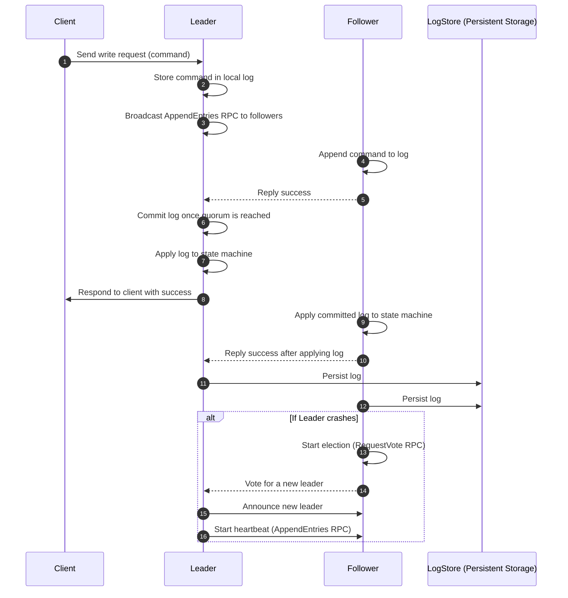
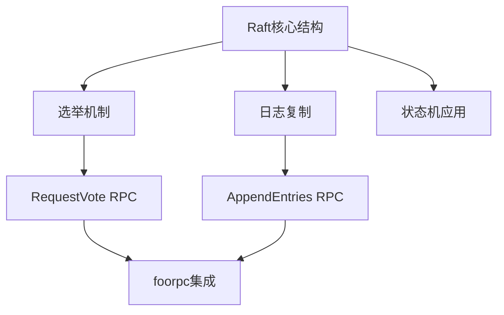
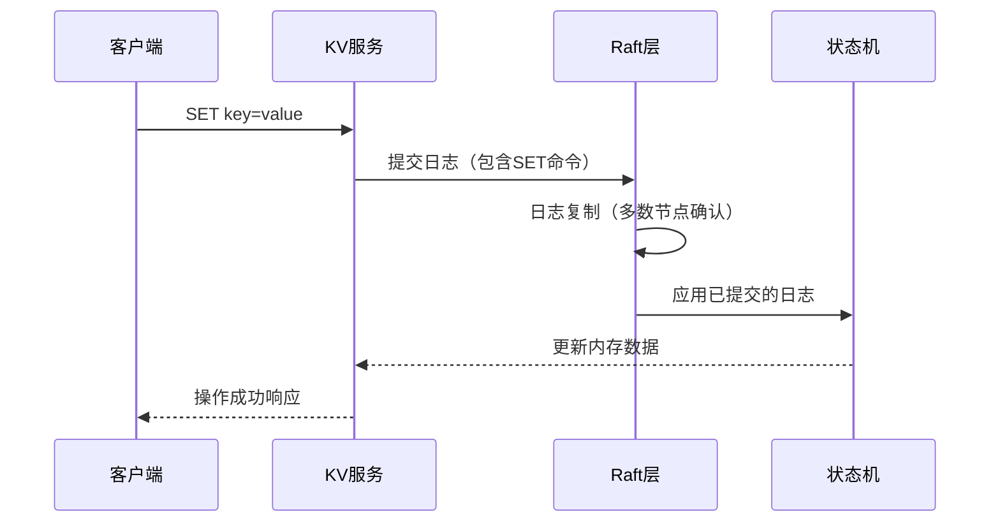

# Raft的流程核心

我需要理清Raft的核心流程，以及各个节点之间的通信。下面是一个简单的流程图。

这个是对Raft核心结构的描述

## 对于Raft层在我的项目中的表示

### 写请求流程

1. 客户端请求首先进入KV服务
2. KV服务将操作封装为日志提交给Raft
3. Raft确保日志被多数节点复制
4. Raft层通知状态机应用该日志

所以说Raft 需要一个独立的状态机来应用日志

## 核心设计原则

- **聚焦核心机制**：保留选举、日志复制、状态机应用等核心流程
- **内存化存储**：用内存代替持久化存储，避免复杂IO操作
- **事件驱动架构**：通过通道传递状态变更事件，便于可视化捕获
- **模拟网络层**：用内存消息传递代替真实RPC，实现可视化动画
- **可观测性优先**：暴露关键状态指标，方便前端实时渲染
