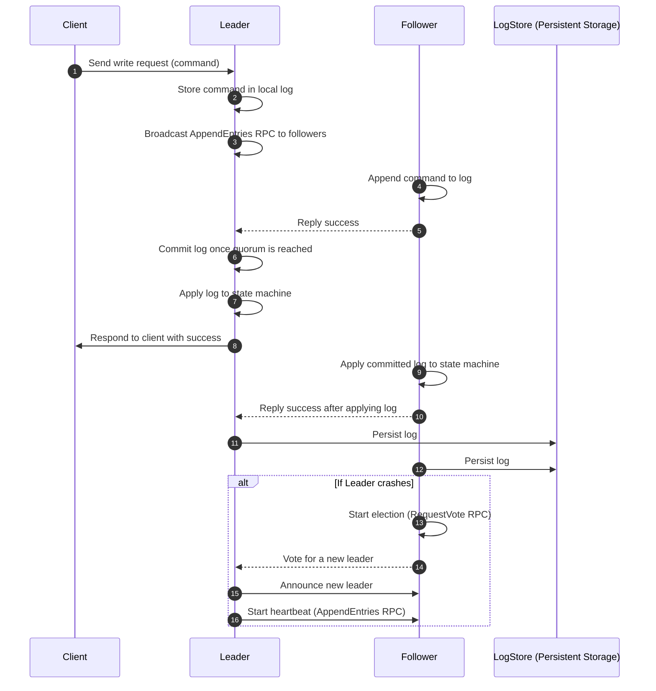

# Raft的流程核心

我需要理清Raft的核心流程，以及各个节点之间的通信。下面是一个简单的流程图。

```mermaid
sequenceDiagram
    autonumber
    participant Client as Client
    participant Leader as Leader
    participant Follower as Follower
    participant LogStore as LogStore (Persistent Storage)

    Client->>Leader: Send write request (command)
    Leader->>Leader: Store command in local log
    Leader->>Leader: Broadcast AppendEntries RPC to followers
    Follower->>Follower: Append command to log
    Follower-->>Leader: Reply success
    Leader->>Leader: Commit log once quorum is reached
    Leader->>Leader: Apply log to state machine
    Leader->>Client: Respond to client with success

    Follower->>Follower: Apply committed log to state machine
    Follower-->>Leader: Reply success after applying log
    Leader->>LogStore: Persist log
    Follower->>LogStore: Persist log

    %% Example of Raft Election
    alt If Leader crashes
        Follower->>Follower: Start election (RequestVote RPC)
        Follower-->>Leader: Vote for a new leader
        Leader->>Follower: Announce new leader
        Leader->>Follower: Start heartbeat (AppendEntries RPC)
    end
```
