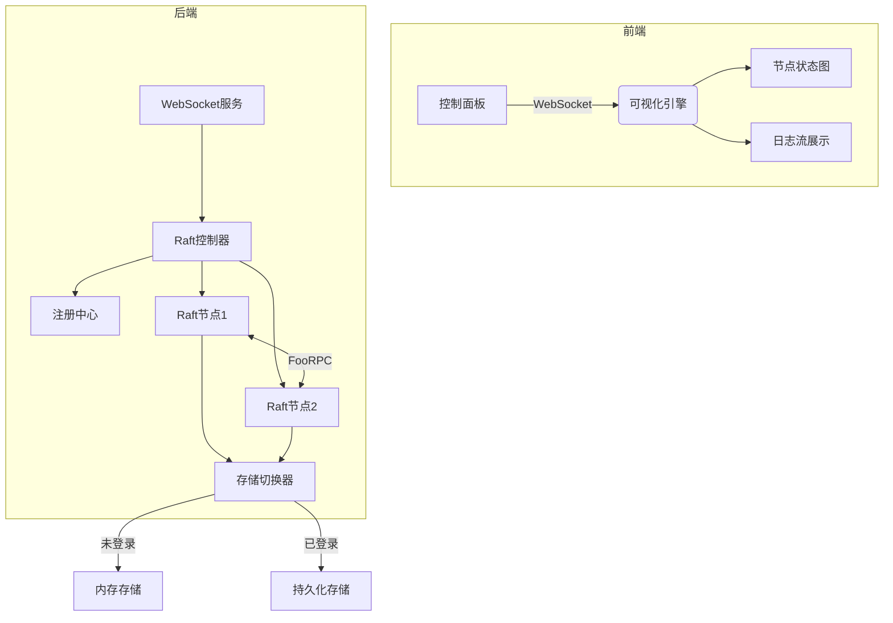

# 算法可视化平台代码流程

## 前端（Next.js）

- 数据接收：通过 WebSocket 或 RESTful API 接收后端传来的实时数据。
- 数据处理与转换：将接收到的结构化数据转换为适合图表展示的格式。
- 渲染逻辑：使用 React 组件和动画库（如 D3.js、Motion）实现动态可视化展示。
- 交互响应：处理用户的交互事件，如点击节点、选择时间范围等，触发相应的数据查询或动画效果。

## 后端（Golang）

- 模拟逻辑：根据 Raft 协议实现选举、投票、写入操作等过程，并记录相关事件。
- 数据收集与发布：将模拟结果通过适当的协议（如 gRPC 或 HTTP）发布到前端。
- 状态更新：根据接收到的用户交互请求，更新 Raft 模拟逻辑并返回最新状态。

## 数据库

- 数据存储：将生成的模拟数据和事件记录存储在数据库中，便于后续查询和分析。
- 日志处理：对 Raft 协议中的关键事件进行日志记录，确保能够追溯系统状态变化。

## 用户交互与界面设计

- 布局设计：优化可视化页面的布局，使各个组件（如节点图、时间线、消息流等）能协同工作。
- 动态交互：实现点击、悬停、选择等操作，触发相应的数据查询或动画效果。
- 反馈机制：提供用户友好的反馈，如工具提示、状态说明等，帮助用户更好地理解系统运行。

## 系统架构设计

```
[ Web前端 ] ↔ WebSocket ↔ [ API网关 ]
                          ↕
[ Raft节点1 ] ↔ RPC ↔ [ Raft节点2 ] ↔ ...
（每个节点包含：状态机 + 持久化存储 + Raft核心）
```


